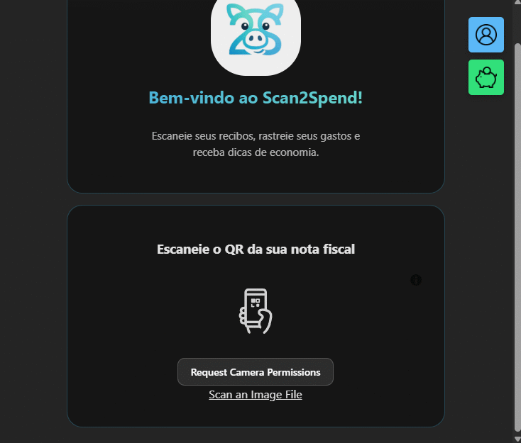
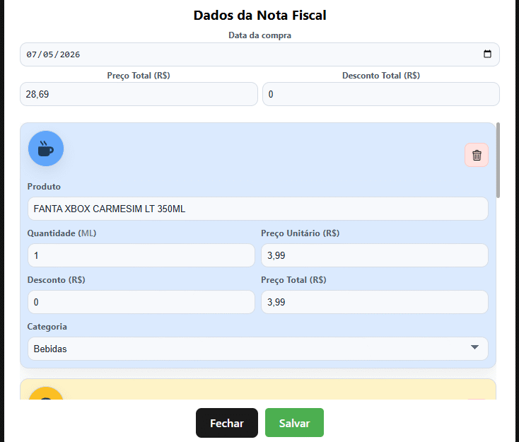
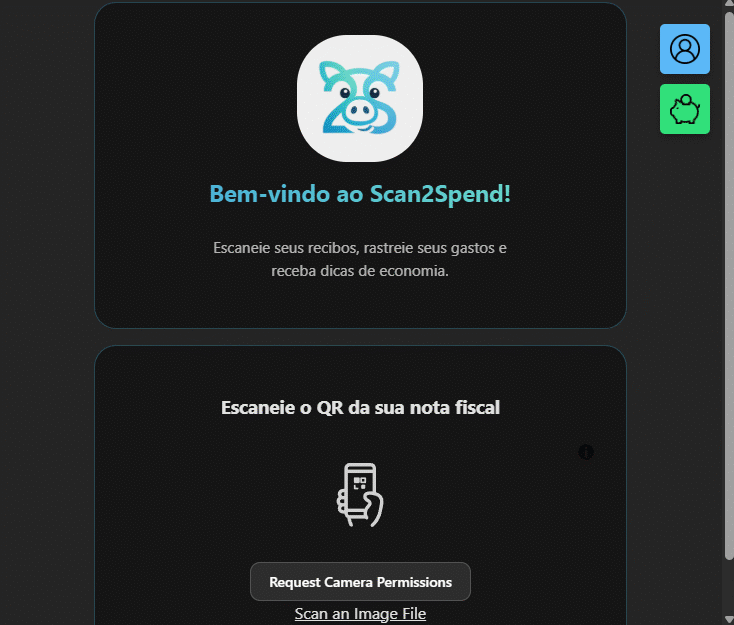

# Scan2Spend

**Scan2Spend** é um aplicativo de controle financeiro que permite escanear o QR Code de notas fiscais eletrônicas (NFC-e) e, automaticamente, extrair os produtos comprados usando inteligência artificial. A ideia é simples: você vai ao mercado, escaneia a nota, e o app já categoriza o que você gastou e mostra tudo em gráficos.

<p align="center">
  
  &nbsp;&nbsp;&nbsp;
  
  &nbsp;&nbsp;&nbsp;
  
</p>

**Acesse o app:** [scan2spend.web.app](https://scan2spend.web.app/)
> A primeira requisição pode demorar alguns segundos — o backend fica inativo quando não há uso e precisa subir o container antes de responder.

---

## Por que esse projeto existe?

Sempre tive interesse em aprender React e FastAPI, mas prefiro aprender fazendo. Em vez de ficar assistindo curso, resolvi me jogar em um projeto real com a intenção de passar por todas as etapas do desenvolvimento: modelar o banco, construir a API, fazer o frontend, colocar tudo em produção. Várias coisas aqui poderiam ser feitas de forma diferente, ou melhor, mas faz parte do processo.

---

## O que o app faz

1. Escaneia o QR Code da nota fiscal com o celular
2. Busca os dados na Sefaz e processa com IA
3. Retorna os produtos já categorizados para revisão e edição
4. Salva e exibe gráficos de gastos por categoria e período

---

## Tecnologias utilizadas

### Frontend

- **React 19**
- **React Router DOM**
- **Vite**
- **Recharts**
- **html5-qrcode**
- **SweetAlert2**
- **React Icons**

### Backend

- **Python + FastAPI**
- **Uvicorn**
- **Playwright**
- **BeautifulSoup4**
- **OpenAI API**
- **PyJWT**
- **oracledb**
- **Pydantic**
- **Docker**

### Banco de dados

- **Oracle Database** (via Oracle Cloud)

O schema do banco foi modelado do zero — tabelas, relacionamentos, sequences e os packages PL/SQL de autenticação (`PKG_AUTH`) com criptografia de senha foram todos criados manualmente. O script completo está em `Backend/baseline.sql`.

### CI/CD

- **GitHub Actions** — análise de segurança com CodeQL a cada push (Python e JavaScript)
- **Google Cloud Run** — conectado ao repositório do GitHub, então a cada push na branch principal o backend é buildado e publicado automaticamente na nuvem

---

## Hospedagem

O frontend está hospedado no **Firebase Hosting** e o backend no **Google Cloud Run**, ambos serviços do Google. O Firebase serve a interface pro usuário e redireciona as chamadas de API pro Cloud Run, que é onde o FastAPI roda. O banco de dados fica na **Oracle Cloud**.

---

## Como as coisas se comunicam

```
[Usuário]
    ↓
[Firebase Hosting]  ← React (HTML/CSS/JS)
    ↓ /api/*
[Google Cloud Run]  ← FastAPI em Docker
    ↓
[Oracle Database]   ← Dados de usuários, notas e produtos
    ↓
[Site da Sefaz]     ← Playwright busca os dados da nota
    ↓
[OpenAI API]        ← IA categoriza os produtos
```

---

## Principais rotas da API

### Autenticação

| Método | Rota | O que faz |
|--------|------|-----------|
| `POST` | `/cadastrarUsuario/` | Cria uma conta nova |
| `POST` | `/login` | Faz login e retorna o JWT |
| `GET` | `/validarToken` | Verifica se o token ainda é válido |
| `GET` | `/me` | Retorna os dados do usuário logado |
| `PUT` | `/usuario` | Atualiza dados do perfil |
| `POST` | `/redefinir_senha` | Envia e-mail de redefinição |
| `PUT` | `/redefinir_senha` | Confirma a nova senha via token do e-mail |

### Notas fiscais

| Método | Rota | O que faz |
|--------|------|-----------|
| `GET` | `/analisar_nf/?QRurl=...` | Acessa a Sefaz e processa a nota com IA |
| `GET` | `/nota_fiscal` | Lista todas as notas do usuário |
| `GET` | `/nota_fiscal/{id}` | Detalha uma nota específica |
| `POST` | `/nota_fiscal` | Salva uma nota nova com seus produtos |
| `PUT` | `/nota_fiscal` | Edita uma nota existente |

### Despesas

| Método | Rota | O que faz |
|--------|------|-----------|
| `GET` | `/despesas/` | Total gasto por período |
| `GET` | `/despesas/categorias` | Gasto por categoria |
| `GET` | `/despesas/categorias/periodo` | Evolução das categorias ao longo do tempo |
| `GET` | `/despesas/topProdutos` | Top 5 produtos mais comprados |
| `GET` | `/descontos/` | Total de descontos recebidos |
| `GET` | `/despesas/insights` | Alertas de orçamento, tendências, dia de pico |
| `GET` | `/despesas/perfil` | Resumo: total gasto, % do orçamento, maior compra |

---

## Rodando localmente

### Backend

```bash
cd Backend
python -m venv .venv
.venv\Scripts\activate
pip install -r requirements.txt
playwright install chromium
```

Crie um arquivo `.env`:

```
DB_USER=
DB_PASSWORD=
DB_SERVICE_NAME=
DB_WALLET_LOCATION=
DB_WALLET_PASSWORD=
SECRET_KEY=
EMAIL_SENDER=
EMAIL_PASSWORD=
OPENAI_API_KEY=
```

```bash
uvicorn main:app --reload
```

### Frontend

```bash
cd Frontend
npm install
npm run dev
```

Crie um arquivo `.env.development`:

```
VITE_API_BASE_URL=http://localhost:8000
```

---

## O que ainda pode melhorar

- **Testes automatizados** — não tem nenhum, tudo foi testado manualmente
- **Edição de produtos** — `CardsEdicao` usa manipulação direta do DOM em vez de estado React
- **Orçamento por categoria** — hoje só existe um limite mensal geral
- **Observabilidade** — sem logs estruturados ou monitoramento de erros em produção

---

## Estrutura de pastas

```
Scan2Spend/
├── Backend/
│   ├── main.py
│   ├── database.py
│   ├── functions.py
│   ├── baseline.sql
│   ├── Dockerfile
│   ├── requirements.txt
│   ├── models/
│   │   └── schemas.py
│   ├── routers/
│   │   ├── auth.py
│   │   ├── despesas.py
│   │   └── notas_fiscais.py
│   └── utils/
│       └── prompt_analise_nf.txt
├── Frontend/
│   ├── src/
│   │   ├── App.jsx
│   │   ├── hooks/
│   │   │   ├── useAuth.js
│   │   │   └── useDespesas.js
│   │   ├── pages/
│   │   │   ├── PaginaInicial.jsx
│   │   │   ├── PaginaDespesas.jsx
│   │   │   ├── PaginaLogin.jsx
│   │   │   └── ResetSenha.jsx
│   │   └── components/
│   └── firebase.json
└── .github/
    └── workflows/
        └── codeql.yml
```

---

## Considerações finais

Esse projeto foi construído com o objetivo de aprender, não de ser perfeito. Cada bug resolvido, cada feature implementada, cada tecnologia nova integrada foi uma aula prática.